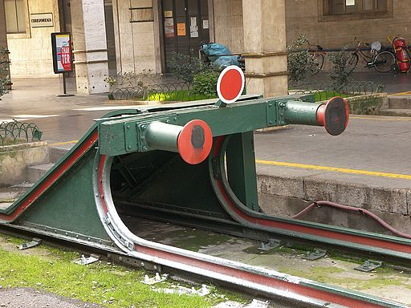
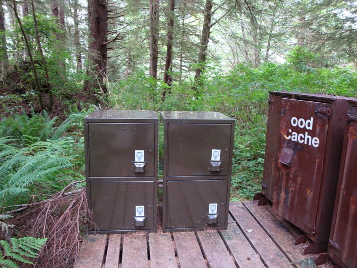

# Cache与Buffer的区别

cache是为了弥补高速设备与低速设备之间的鸿沟而引入的中间层, 最终起到`加快访问速度`的作用.  
而buffer的作用主要进行流量整形, 将突发的, 大数量的, 较小规模的I/O整理成平稳的小数量而较大规模的I/O, 以`减少响应次数`.

buffer的例子: 在网上下电影, 不能下一点就写一下硬盘, 而是积攒一定量的数据后再一整块写, 不然硬盘承受不住.  

cache翻译为"缓存"不太合适, 按台湾的做法译为"快取"会更合适. 
 

## 概念默写

1. Buffer（缓冲区）是系统两端处理速度平衡（从长时间尺度上看）时使用的。它的引入是为了减小短期内突发I/O的影响，起到流量整形的作用。比如生产者——消费者问题，他们产生和消耗资源的速度大体接近，加一个buffer可以抵消掉资源刚产生/消耗时的突然变化。
2. Cache（缓存）则是系统两端处理速度不匹配时的一种折衷策略。因为CPU和memory之间的速度差异越来越大，所以人们充分利用数据的局部性（locality）特征，通过使用存储系统分级（memory hierarchy）的策略来减小这种差异带来的影响。

## 延伸

1. 假定以后存储器访问变得跟CPU做计算一样快，cache就可以消失，但是buffer依然存在。比如从网络上下载东西，瞬时速率可能会有较大变化，但从长期来看却是稳定的，这样就能通过引入一个buffer使得OS接收数据的速率更稳定，进一步减少对磁盘的伤害。
2. TLB（Translation Lookaside Buffer，翻译后备缓冲器）名字起错了，其实它是一个cache.