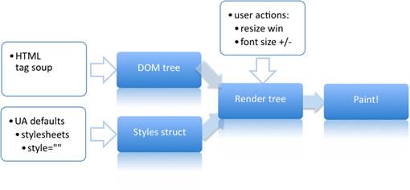

# 重排/回流(reflow)与重绘(repaint)

DOM树描述该页面的结构, 而renderf负责描述DOM节点(nodes)在页面上如何呈现

当DOM元素属性发生变化(eg: color), 浏览器会通知render重新描绘该节点, 称为repaint;  
而如果该次变化涉及页面布局(width, height, display:none等), 浏览器会抛弃原有属性, 重新计算并将结果传给render以重新描绘页面元素, 称为reflow. 

## 页面渲染的过程

1. 解析HTML代码并生成一个 DOM 树。  
2. 解析CSS文件，顺序为：浏览器默认样式 -> 自定义样式 -> 页面内的样式。  
3. 生成一个渲染树（render tree）。这个渲染树和DOM树的不同之处在于，它是受样式影响的。它不包括那些不可见的节点。  
4. 当渲染树生成之后，浏览器就会在屏幕上“画”出所有渲染树中的节点。  

## document.createFragment()批量生成元素与批量更改元素的讨论

批量建立100个li元素的方法: 可先使用createFragment(), 先批量将对应的HTML代码以字符串形式存储在一个变量, 例如template中, 再将其append到对应的元素底下.  
如果变成有序地批量更改100个li元素的要求的话, 可以转换成先将原来的100个删除掉, 再createFragment, append到上面去. 但这样应该会导致两次页面重排.
即便只是发生在一个ul里.
或许可以尝试获取到对应的ul, 然后再通过document.getElementByTagName('li'), 然后获得一个nodeList对象, 再遍历改变内部的值会比较好.  